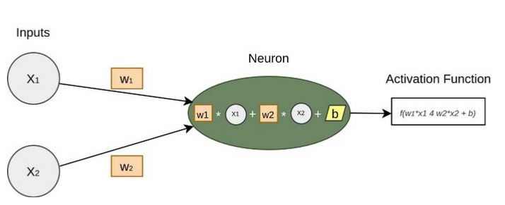
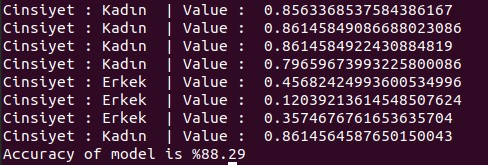

# neural-network-project

Veri seti verilen (boy-kilo) cinsiyet tahmini yapan yapay sinir ağı modeli oluşturulması

Bu projemizde belirli fonksiyonları, girdi ve çıktıları olan
veri setini kullanarak bir yapay sinir ağı modeli oluşturmayı ve bu modeli
eğitmeyi hedefledim.

Nöronlar, içerisinde her bir bağlantının Ağırlık(W) değerini
ve Bias(b) değeri bulundurmaktadır. Nöronlar girdi katmanıdan aldığı değerleri
o girdiye ait Ağırlık (W) değeri ile çarpıp ardından bias(b) değeri ile
toplamakla görevlidir.

Yukarıdaki işlemler gerçekleştikten sonra nöron, en son bir
aktivasyon fonksiyonu kullanarak elde edilen değeri 0 ile 1 arasında
oluşturmaktadır. Bu sayede kontrolsüz veya sınırsız olarak gelen veri tahmin
edilir bir değere dönüştürülmektedir. Kullanılan aktivasyon fonksiyonlarında
Sigmoid ve Softmax fonksiyonlarından faydalandım.

Örnek çıktı ->

